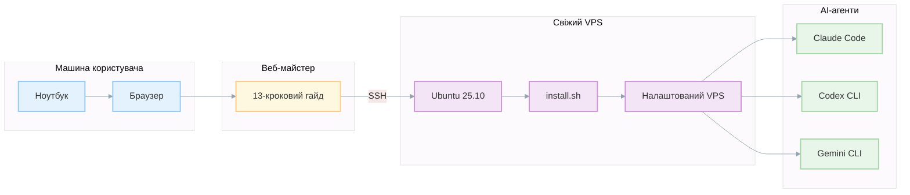
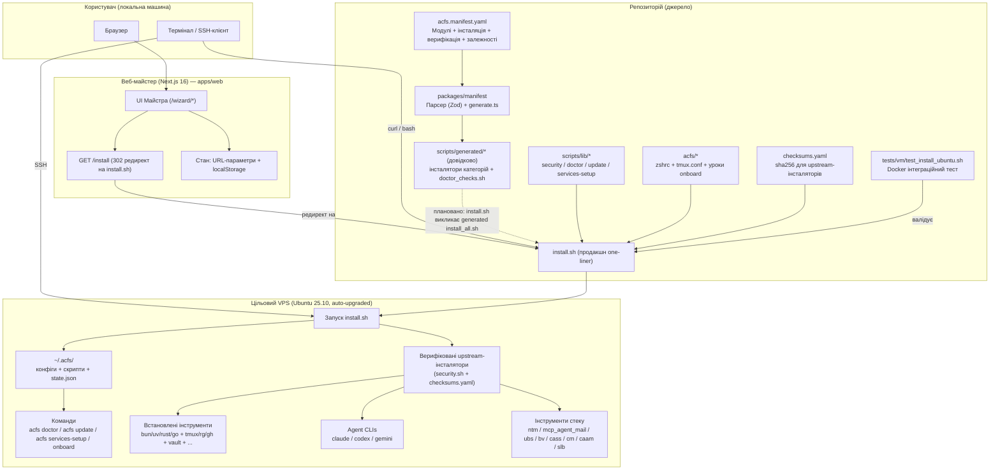

# Agentic Coding Flywheel Setup (ACFS)


<p align="center">
  <strong><a href="https://agent-flywheel.com">agent-flywheel.com</a></strong> — Інтерактивний майстер налаштування для початківців
</p>

> **Від нуля до повністю налаштованого VPS для агентного кодування за 30 хвилин.**
> Комплексна система розгортання, що перетворює свіжий Ubuntu VPS на професійне середовище розробки з ШІ.

<div align="center" style="margin: 1.2em 0;">
  <table>
    <tr>
      <td align="center" style="padding: 8px;">
        <strong>Візія</strong><br/>
        <sub>Початківець з ноутбуком → Майстер → VPS → Агенти пишуть код за вас</sub>
      </td>
    </tr>
  </table>
</div>

### Швидке встановлення

```bash
curl -fsSL "https://raw.githubusercontent.com/Dicklesworthstone/agentic_coding_flywheel_setup/main/install.sh?$(date +%s)" | bash -s -- --yes --mode vibe
```

Інсталятор **ідемпотентний** — якщо перервано, просто перезапустіть. Він автоматично продовжить з останньої завершеної фази без додаткових запитань.

> **Для продакшн-середовищ:** Для стабільних, відтворюваних встановлень використовуйте конкретний реліз або коміт:
> ```bash
> # Рекомендовано: використовуйте тегований реліз (напр., v0.1.0)
> ACFS_REF=v0.1.0 curl -fsSL "https://raw.githubusercontent.com/Dicklesworthstone/agentic_coding_flywheel_setup/v0.1.0/install.sh" | bash -s -- --yes --mode vibe
>
> # Альтернатива: прив'яжіться до конкретного SHA коміту
> ACFS_REF=abc1234 curl -fsSL "https://raw.githubusercontent.com/Dicklesworthstone/agentic_coding_flywheel_setup/abc1234/install.sh" | bash -s -- --yes --mode vibe
> ```
> Теговані релізи протестовані та стабільні. Встановлення `ACFS_REF` гарантує, що всі завантажені скрипти використовують ту саму версію.

---

## Коротко

**ACFS** — це комплексна система для розгортання середовищ агентного кодування:

**Чому це важливо:**
- **Від нуля до героя:** Проводить повних початківців від "маю ноутбук" до "маю агентів Claude/Codex/Gemini, що пишуть код для мене на VPS"
- **Магія одного рядка:** Одна команда `curl | bash` встановлює 30+ інструментів, налаштовує все і запускає три AI-агенти для кодування
- **Vibe Mode:** Попередньо налаштований для максимальної швидкості — sudo без пароля, увімкнені небезпечні прапорці агентів, оптимізоване середовище shell
- **Перевірений стек:** Включає повний стек Dicklesworthstone (8 інструментів) для оркестрації, координації та безпеки агентів

**Що ви отримаєте:**
- Сучасний shell (zsh + oh-my-zsh + powerlevel10k)
- Всі мовні середовища виконання (bun, uv/Python, Rust, Go)
- Три AI-агенти для кодування (Claude Code, Codex CLI, Gemini CLI)
- Інструменти координації агентів (NTM, MCP Agent Mail, SLB)
- Хмарні CLI (Vault, Wrangler, Supabase, Vercel)
- І ще 20+ інструментів розробника

---

## Досвід ACFS



### Для початківців
ACFS включає **покроковий веб-майстер** на [agent-flywheel.com](https://agent-flywheel.com), який проводить повних початківців через:
1. Встановлення терміналу на локальній машині
2. Генерацію SSH-ключів (для безпечного доступу пізніше)
3. Оренду VPS у провайдерів на кшталт OVH чи Contabo
4. Підключення через SSH з паролем (початкове налаштування)
5. Запуск інсталятора (який налаштовує доступ за ключем)
6. Повторне підключення безпечно з вашим SSH-ключем
7. Початок кодування з ШІ-агентами

### Для розробників
ACFS — це **один рядок**, що перетворює будь-який свіжий Ubuntu VPS на повністю налаштоване середовище розробки з сучасними інструментами та трьома готовими ШІ-агентами для кодування.

### Для команд
ACFS забезпечує **відтворюване, ідемпотентне** налаштування, що гарантує ідентичність VPS-середовищ всіх членів команди — усуваючи проблему "працює на моїй машині" для агентних робочих процесів.

---

## Архітектура та дизайн

ACFS побудований навколо **єдиного джерела істини**: файлу маніфесту. Все інше — скрипти інсталятора, перевірки doctor, контент вебсайту — походить від цього центрального визначення. Ця архітектура забезпечує узгодженість і робить систему легкою для розширення.

### Потік даних системи



```
┌─────────────────────────────────────────────────────────────────────────────┐
│                          ЄДИНЕ ДЖЕРЕЛО ІСТИНИ                               │
│  ┌─────────────────────────────────────────────────────────────────────┐    │
│  │  acfs.manifest.yaml                                                  │    │
│  │  Визначення інструментів • Команди інсталяції • Логіка верифікації  │    │
│  └─────────────────────────────────────────────────────────────────────┘    │
└─────────────────────────────────────────────────────────────────────────────┘
                                      │
                    ┌─────────────────┴─────────────────┐
                    ▼                                   ▼
┌───────────────────────────────────┐   ┌───────────────────────────────────┐
│       ГЕНЕРАЦІЯ КОДУ              │   │       ВЕБ-МАЙСТЕР                 │
│  ┌─────────────────────────────┐  │   │  ┌─────────────────────────────┐  │
│  │ TypeScript Parser (Zod)     │  │   │  │ apps/web/ (Next.js 16)      │  │
│  │ generate.ts                 │  │   │  │ agent-flywheel.com          │  │
│  └─────────────────────────────┘  │   │  └─────────────────────────────┘  │
└───────────────────────────────────┘   └───────────────────────────────────┘
                    │
                    ▼
┌───────────────────────────────────────────────────────────────────────────┐
│                  ЗГЕНЕРОВАНІ ВИХІДНІ ДАНІ (ДОВІДКОВО)                      │
│  ┌────────────────────┐  ┌────────────────────┐  ┌────────────────────┐   │
│  │ scripts/generated/ │  │ doctor_checks.sh   │  │ install_all.sh     │   │
│  │ 11 скриптів        │  │ Логіка верифікації │  │ Головний інсталятор│   │
│  └────────────────────┘  └────────────────────┘  └────────────────────┘   │
└───────────────────────────────────────────────────────────────────────────┘
                    │
                    ▼
┌───────────────────────────────────────────────────────────────────────────┐
│                           ІНСТАЛЯТОР                                       │
│  install.sh + scripts/lib/*.sh + checksums.yaml (SHA256 верифікація)      │
│  (scripts/generated/* поки не викликаються install.sh)                     │
└───────────────────────────────────────────────────────────────────────────┘
                    │
                    ▼
┌───────────────────────────────────────────────────────────────────────────┐
│                          ЦІЛЬОВИЙ VPS                                      │
│  ┌──────────────┐  ┌──────────────┐  ┌──────────────┐  ┌──────────────┐   │
│  │ 30+ інстру-  │  │ zsh + p10k   │  │ AI-агенти    │  │ ~/.acfs/     │   │
│  │ ментів       │  │ Shell-конфіг │  │ Claude/Codex │  │ Конфігурації │   │
│  └──────────────┘  └──────────────┘  └──────────────┘  └──────────────┘   │
└───────────────────────────────────────────────────────────────────────────┘
```

### Чому така архітектура?

**Єдине джерело істини**: Файл маніфесту (`acfs.manifest.yaml`) визначає кожен інструмент — його назву, опис, команди інсталяції та логіку верифікації. Коли ви додаєте або редагуєте інструмент у маніфесті, генератор автоматично оновлює згенеровані скрипти та перевірки на основі маніфесту. Продакшн one-liner інсталятор (`install.sh`) досі написаний вручну, тому зміни поведінки можуть також вимагати оновлення `install.sh` до повної міграції.

**TypeScript + Zod валідація**: Парсер маніфесту використовує Zod-схеми для валідації YAML під час парсингу. Помилки, відсутні поля та структурні проблеми виявляються одразу під час генерації — а не під час виконання на VPS користувача, коли інсталятор падає на середині.

**Згенеровані скрипти**: Замість ручного підтримання 11 скриптів категорій та їх синхронізації, генератор створює їх з маніфесту. Це означає:
- Узгоджений, аудитований вигляд логіки інсталяції (деякі модулі навмисно генерують TODO)
- Послідовна обробка помилок та логування для всіх модулів
- Чіткий шлях до майбутньої інтеграції з інсталятором

### Компоненти

| Компонент | Шлях | Технологія | Призначення |
|-----------|------|------------|-------------|
| **Маніфест** | `acfs.manifest.yaml` | YAML | Єдине джерело істини для всіх інструментів |
| **Генератор** | `packages/manifest/src/generate.ts` | TypeScript/Bun | Створює скрипти з маніфесту |
| **Вебсайт** | `apps/web/` | Next.js 16 + Tailwind 4 | Покроковий майстер для початківців |
| **Інсталятор** | `install.sh` | Bash | Bootstrap-скрипт one-liner |
| **Скрипти бібліотеки** | `scripts/lib/` | Bash | Модульні функції інсталятора |
| **Згенеровані скрипти** | `scripts/generated/` | Bash | Авто-згенеровані інсталятори категорій |
| **Конфіги** | `acfs/` | Shell/Tmux configs | Файли для `~/.acfs/` |
| **Онбордінг** | `acfs/onboard/` | Bash + Markdown | Інтерактивна система навчання |
| **Контрольні суми** | `checksums.yaml` | YAML | SHA256 хеші для upstream-інсталяторів |

---
